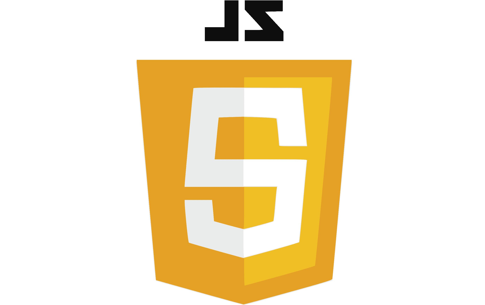
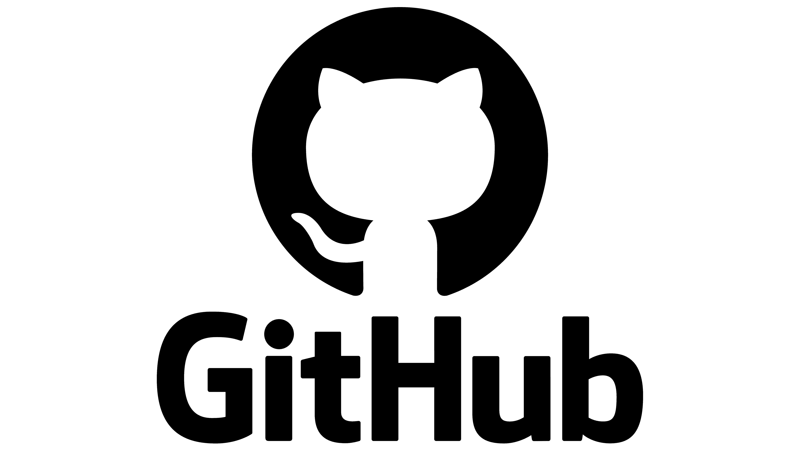

<h1 align="center">Encrypted</h1>
 
<br>
<p>Hello, we are Encrypted!</p>
<p>Encrypted is a young, ambitious team of developers driven by curiosity, creativity, and a love for problem‑solving.  
We challenge ourselves to build projects that blend logic, design, and technology — and our maze solving website is a perfect example of that spirit.

Our project creates fully randomized mazes and uses smart algorithms to determine whether each maze is solvable or impossible, visualizing the entire process in a clean, interactive way. It’s a blend of mathematics, programming, and user‑friendly design — all crafted by a team that’s passionate about learning and pushing boundaries.

We’re not just building software.
We’re building experience, teamwork, and the foundation for the developers we want to become.</p>
<br>
 
<h2 align="left">🚀 Languages</h2>
<p align="left">
  
  
  
</p>
 
<h2 align="left">🔧 Used Tools </h2>
<p align="left">
   
   
   
   
   
 <br>
 
<h2 align="left">📄 Documents</h2><br>
  <ul>
    <li><a href="https://codingburgas-my.sharepoint.com/:w:/g/personal/miiliev24_codingburgas_bg/IQAdMiFcjh51RKG6O6gjd32CAU1syIHPfVmDrVlgUMtu5fw?e=wCcYVW">Documentation</a></li>
    <li><a href="https://codingburgas-my.sharepoint.com/:p:/g/personal/ihiliev24_codingburgas_bg/IQAUNSvGrK_IR4I6KQ4X_BgkASOt5sQ4UhpvesnBgPWe4gQ?e=Z40POv">Presentation</a></li>
  </ul>  
 
<h2 align="left">👨🏻💻 Team Members </h2>
<table >
  <tr>
    <td align="center">Name</td>
    <td align="center">Role</td>
    <td align="center">Grade</td>
    <td align="center">Github</td>
  </tr>
    <tr>
    <td align="center">Iliyan Iliev</td>
    <td align="center">Scrum Trainer</td>
    <td align="center">🟩 9V</td>
    <td align="center"> <a href="https://github.com/IHIliev24">IHIliev24 </a></td>
  </tr>
  <tr>
    <td align="center">Maksim Iliev</td>
    <td align="center">Frontend developer</td>
    <td align="center">🟩 9V</td>
    <td align="center"> <a href="https://github.com/MaxIliev27">MaxIliev27 </a></td>
  </tr>
  <tr>
    <td align="center">Dimitar Yanakiev</td>
    <td align="center">Backend developer</td>
    <td align="center">🟩 9V</td>
    <td align="center"> <a href="https://github.com/DimitarYanakiev">DVYanakiev24 </a></td>
  </tr>
  </table>
<br>
 
 <h2 align="left">🔑 Access</h2>
 
 <p>How to clone our repository: </p>
 <ol>
  <li>Press Win + R</li>
  <li>Type in cmd</li>
  <li>Enter cd + the name of the folder in which you want to save the project</li>
  <li>Run the clone command by typing
  git clone + the link below</li>
 </ol>
 
```
https://github.com/codingburgas/2526-dual-education-encrypted-1.git
```